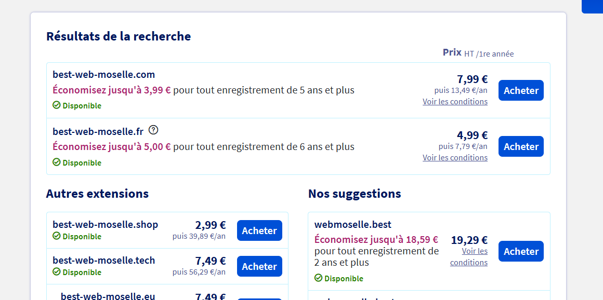
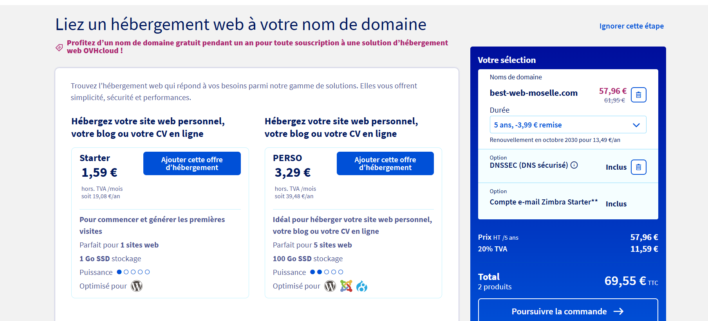

# Questions

Répondez ici aux questions théoriques en détaillant un maxium vos réponses :

1) Expliquer la procédure pour réserver un nom de domaine chez OVH avec des captures d'écran (arrêtez-vous au paiement) :

La procèdure est asez simple :
    1. Ce rendre sur le site OVH
    2. Chosiir sont extensions ( .fr, .com, .shop, etc...)
    3. Nous pouvons rechercher le nom de domaine qui nous interesse et voir sur quelles extensions ce nom est déjà utilisé.
    
    4. Plusieurs options peuvent êtres ajoutés a l'offre de base.
    
    5. Et enfin nous avons un récapitulatif de la commande

2. Comment faire pour qu'un nom de domaine pointe vers une adresse IP spécifique ?
    Les interfaces des hébergeurs sont toutes à peu près similaires, c’est-à-dire que leur ergonomie varie, mais les fonctionnalités restent les mêmes. Vous y trouverez un onglet « redirection », puis une option « ajouter une redirection ». Vous choisissez le sous-domaine concerné, et sélectionnez une redirection vers une URL (adresse web complète), un domaine (canonical name) ou une adresse IP.

3. Comment mettre en place un certificat SSL ?
    1. Connectez-vous à votre espace client OVHcloud.
    2. Cliquez sur l'onglet Web Cloud.
    3. Dans la colonne de gauche, cliquez sur le menu Hébergements.
    4. Sélectionnez l'hébergement web concerné.
    5. Sur la page qui s'affiche, restez dans l'onglet Informations générales.
    6. Positionnez-vous dans l'encadré intitulé Configuration.
    7. A droite de la mention Certificat SSL, cliquez sur le bouton ..., puis sur Commander un certificat SSL.
